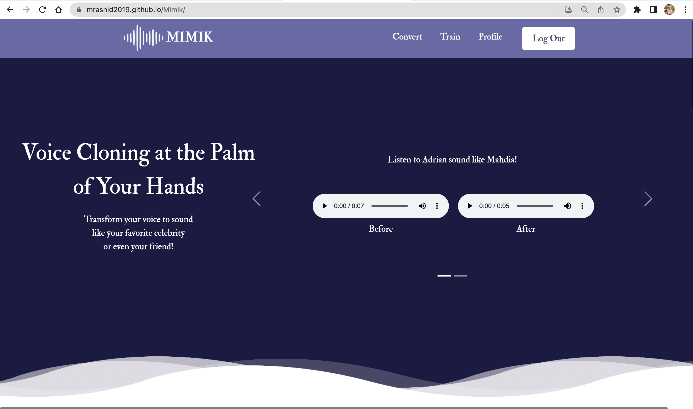
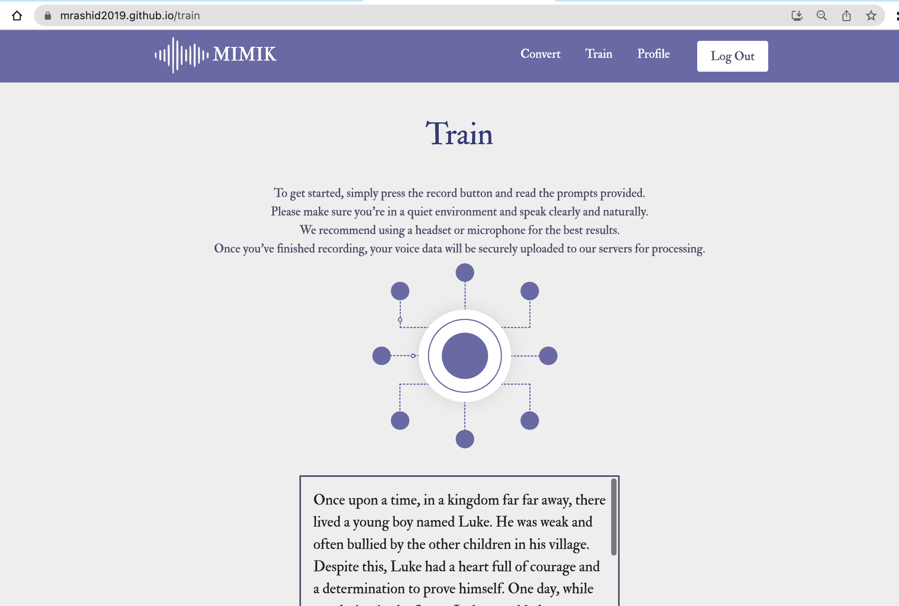
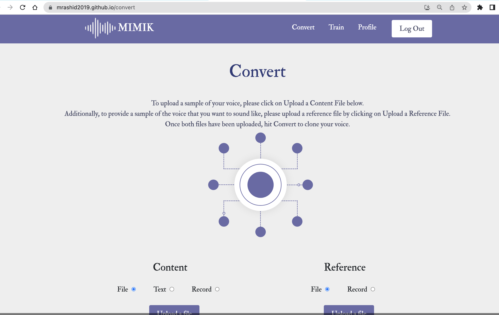

# Mimik - Voice Cloning Application
Our Application will allow users to convert the voice into the voice of someone else which can be impactful and situations were individuals with thick accents, have trouble communicating with others. Being able to speak in the voice of another person can make it easier for them to communicate with a native population. Mimik will also allow users to train their own voice and share it with others by including the train voice in the data set. We have implemented this using 2 subsystems: a speech to text up system, which is a speech recognition portion and the text to speech subsystem, which would be the speech synthesis portion. For our individual group members, we have also created a sample data set of our voices to train and fine tune on. 

Link to Mimik: https://mrashid2019.github.io/Mimik/

## Technologies Used 
- Languages: Python, JavaScript 
- Frameworks: React, Coqui TTS, Whispr
- Libraries: Bootstrap, Material UI, Firebase
- Tools: Flask, GitHub Pages 
- Database: Firestore Database

## Screenshots 
### Home page 

### Train page 

### Convert page 

## Engineering Design Project 
- Members:
  - Fatimah Ali
  - Wilmayer Dure
  - Nelly Delgado Plache 
  - Adrian Echazabal
  - Mahdia Rashid 
